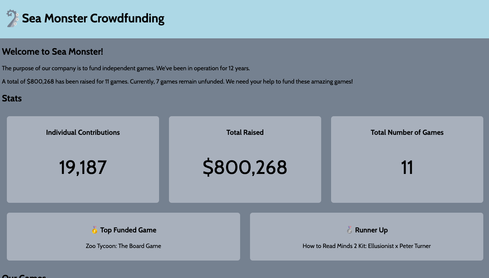

# WEB102 Prework - *Sea Monster Crowdfunding*

Submitted by: Emily Wang
Total time spent: 5 hours

## Overview

A website for Sea Monster Crowdfunding that showcases information about the games they have funded, along with stats and filtering options for viewing funded or unfunded games.

## Features

**Core Functionality**

- Introduction section explains the company’s background and highlights the number of unfunded games.
- Stats section displays total contributions, dollars raised, and the top two most funded games.
- The "Our Games" section lists all games and includes buttons to filter between funded, unfunded, or all games.

T**Optional Features**

- Additional improvements added for app functionality.

## Video Walkthrough

Here's a walkthrough of implemented features:

<!-- Replace this with whatever GIF tool you used! -->
GIF created with LICEcap  

## License

This project is licensed under the Apache License, Version 2.0. You may obtain a copy of the License at http://www.apache.org/licenses/LICENSE-2.0.
